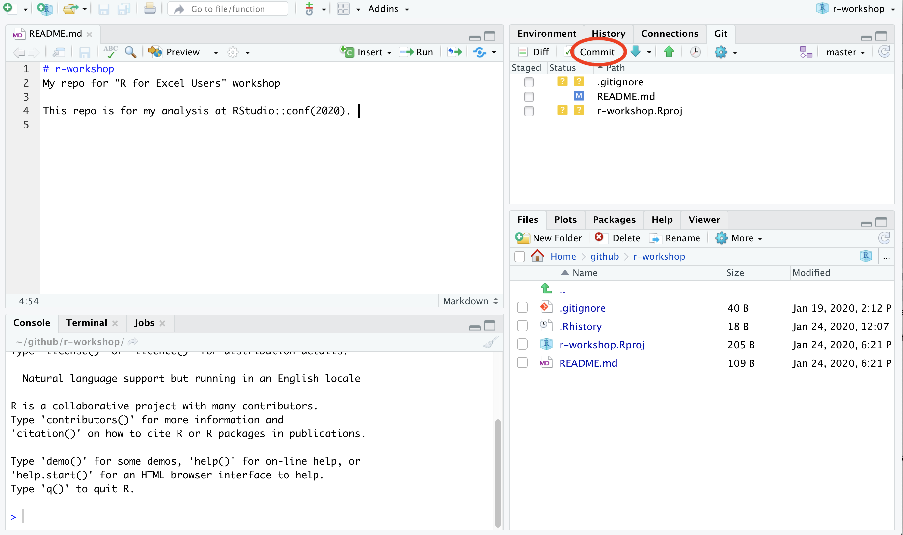
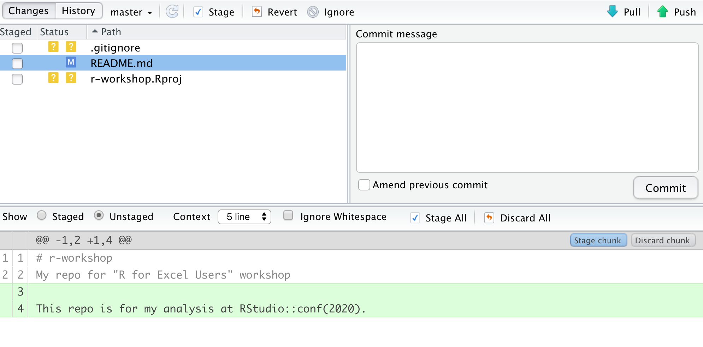
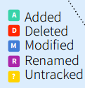
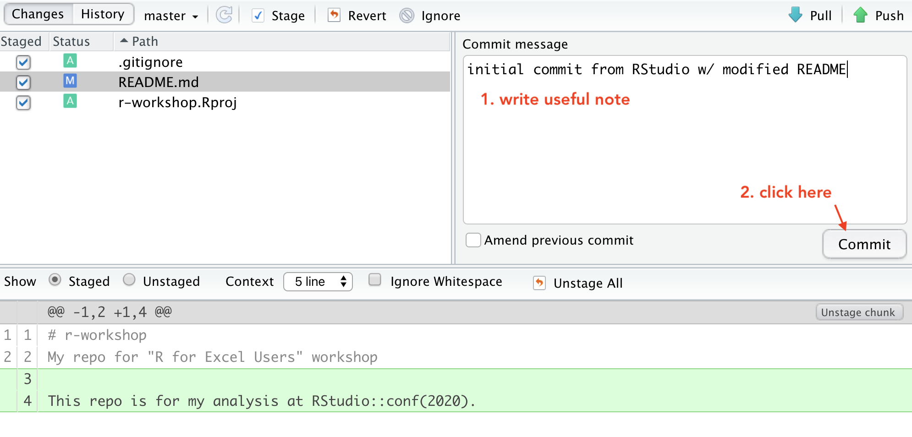
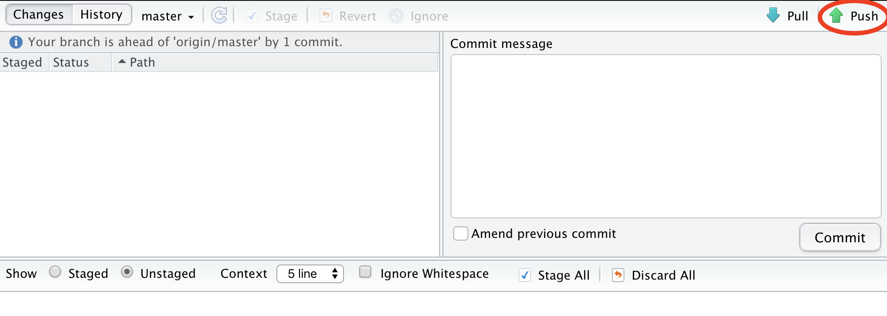

This is an intro workflow to set up and contribute to a Quarto book, originally from the GitHub browser. Originally created to help a colleague who is Deputy Director of an academic center to create open onboarding docs.

We'll create a copy of this book that you can edit yourself: <https://openscapes.github.io/quarto-site-template>

## Setup

### Download template site

1. Download <https://github.com/Openscapes/quarto-site-template> 
  1. Green button > Download ZIP
  1. On your computer: unzip files

### Create a GitHub repo 

### Add template site files

1. Add file > Upload files > Select all the files in unzipped folder > drag to GitHub
1. Commit

### Set up GitHub publishing

1. Add file > create new file > name it exactly `.github/workflows/quarto-render.yml`
1. Paste inside: 

``` yaml
name: Render and deploy quarto files
on: 
  push:
  pull_request:

jobs:
  quarto-render-and-deploy:
    runs-on: ubuntu-latest
    steps:
    - uses: actions/checkout@v2

    - name: "Install Quarto and render project"
      uses: nasa-openscapes/quarto-render@v0.3.79 

    - name: "Deploy to gh-pages"
      uses: peaceiris/actions-gh-pages@v3
      if: github.ref == 'refs/heads/main'
      with:
        github_token: ${{ secrets.GITHUB_TOKEN }}
        publish_dir: ./_site
```

1. (Don't Create a branch called `gh-pages` - all lowercase, with a hyphen bc already made!)
1. (Don't need to 1. Settings > Pages > Source) bc it's automatic
1. Go into `_quarto.yml` and update the urls with your own urls, i.e. `https://your-username/your-repo-name.github.io`
1. Wait until orange dot turns green
1. Inspect: `https://your-username/your-repo-name.github.io`. For example: <https://openscapes.github.io/quarto-site-template>

## Develop content

Now you can start editing these files with what you want them to say! Start off from the browser, using Markdown. *Add details here*. 

If you'd like to add a new chapter, you'll need to update the `_quarto.yml` file and create a new .md file; start by copying an existing one. *More details coming as we do this together.*

Instead of editing from the browser, you can work locally with whatever software/editor you like (RStudio, JupyterLab, etc). 

## Setup RStudio (optional)


*The following is consolidated from <https://rstudio-conf-2020.github.io/r-for-excel/>.* 

### Download and install 

*From [r-for-excel::prerequesites](https://rstudio-conf-2020.github.io/r-for-excel/index.html#prerequisites)* 

1. **Download and install R and RStudio**
    - R: <https://cloud.r-project.org/>
    - RStudio: <http://www.rstudio.com/download> 
    - Follow your operating system's normal installation process
1. **Create a GitHub account**
    - GitHub: <https://github.com>
    - Follow optional [advice on choosing your username](https://happygitwithr.com/github-acct.html)
    - Remember your username, email and password; we will need them for the workshop!
1. **Download and install Git**
    - Git: <https://git-scm.com/downloads>
    - Follow your operating system's normal installation process. Note: you will not see an application called Git listed but if the installation process completed it was likely successful, and we will confirm together
1. **Download workshop data** 
    - Google Drive folder: [r-for-excel-data ](https://drive.google.com/drive/folders/1RywSUw8hxETlROdIhLIntxPsZq0tKSdS?usp=sharing)
    - Save it temporarily somewhere you will remember; we will move it together
   
   
## Configure RStudio with GitHub

*From [r-for-excel::github-brief-intro-config](https://rstudio-conf-2020.github.io/r-for-excel/rstudio.html#github-brief-intro-config)*

Before we break, we are going to set up Git and GitHub which we will be using along with R and RStudio for the rest of the workshop. 

Before we do the setup configuration, let me take a moment to talk about what Git and GitHub are. 

It helps me to think of GitHub like Dropbox: you identify folders for GitHub to 'track' and it syncs them to the cloud. This is good first-and-foremost because it makes a back-up copy of your files: if your computer dies not all of your work is gone. But with GitHub, you have to be more deliberate about when syncs are made. This is because GitHub saves these as different versions, with information about who contributed when, line-by-line. This makes collaboration easier, and it allows you to roll-back to different versions or contribute to others' work.

git will track and version your files, GitHub stores this online and enables you to collaborate with others (and yourself). Although git and GitHub are two different things, distinct from each other, we can think of them as a bundle since we will always use them together. 

### Configure GitHub

This set up is a one-time thing! You will only have to do this once per computer. We'll walk through this together. In a browser, go to github.com and to your profile page as a reminder.   

**You will need to remember your GitHub username, the email address you created your GitHub account with, and your GitHub password.** 

We will be using the `use_git_config()` function from the `usethis` package we just installed.

```{r}
#| eval: false
## install the usethis package
install.packages("usethis")

## use_git_config function with my username and email as arguments
usethis::use_git_config(user.name = "jules32", user.email = "jules32@example.org")
```

If you see `Error in use_git_config() : could not find function "use_git_config"` please run `library("usethis")`

### Ensure that Git/GitHub/RStudio are communicating

We are going to go through a few steps to ensure the Git/GitHub are communicating with RStudio

#### RStudio: New Project

Click on New Project. There are a few different ways; you could also go to File > New Project..., or click the little green + with the R box in the top left.
also in the File menu).

<br>


{width="80%"} 

<br>


#### Select Version Control

<br>

{width="80%"} 

<br>

#### Select Git

Since we are using git. 

<br>

{width="80%"} ```

<br>

Do you see what I see? 

<br>

{width="80%"} 

<br>

If yes, hooray! Time for a break!

If no, we will help you troubleshoot.

1. Double check that GitHub username and email are correct
1. Troubleshooting, starting with [HappyGitWithR's troubleshooting chapter](http://happygitwithr.com/troubleshooting.html)
  - `which git` (Mac, Linux, or anything running a bash shell)
  - `where git` (Windows, when not in a bash shell)
1. Potentially set up a RStudio Cloud account: <https://rstudio.cloud/>

<!--- [Allison 206/244 googledoc](https://docs.google.com/document/d/1zx2upJJqFZe94O3BQSMI56Z76s3haLXC0otKSpcZaJQ/edit)
--->

### Troubleshooting

#### Configure git from Terminal

If `usethis` fails, the following is the classic approach to configuring **git**.  Open the Git Bash program (Windows) or the Terminal (Mac) and type the following:

        # display your version of git
        git --version
        
        # replace USER with your Github user account
        git config --global user.name USER
        
        # replace NAME@EMAIL.EDU with the email you used to register with Github
        git config --global user.email NAME@EMAIL.EDU
        
        # list your config to confirm user.* variables set
        git config --list

This will configure git with global (`--global`) commands, which means it will apply 'globally' to all your future github repositories, rather than only to this one now. **Note for PCs**: We've seen PC failures correct themselves by doing the above but omitting `--global`. (Then you will need to configure GitHub for every repo you clone but that is fine for now).

#### Troubleshooting

All troubleshooting starts with reading Happy Git With R's [RStudio, Git, GitHub Hell](http://happygitwithr.com/troubleshooting.html) troubleshooting chapter. 

##### New(ish) Error on a Mac
We've also seen the following errors from RStudio: 

```
error key does not contain a section --global terminal
```
and
```
fatal: not in a git directory
```

To solve this, go to the Terminal and type:
    ```
which git
```


  
Look at the filepath that is returned. Does it say anything to do with Apple?

-> If yes, then the [Git you downloaded](https://git-scm.com/downloads) isn't installed, please redownload if necessary, and follow instructions to install.  

-> If no, (in the example image, the filepath does not say anything with Apple) then proceed below:

In RStudio, navigate to: Tools > Global Options > Git/SVN. 


<br>

Does the **“Git executable”** filepath match what the url in Terminal says? 

<br>


If not, click the browse button and navigate there.   

>*Note*: on my laptop, even though I navigated to /usr/local/bin/git, it then automatically redirect because /usr/local/bin/git was an alias on my computer. That is fine. Click OK.


## Sync from RStudio (local) to GitHub (remote)

Syncing to GitHub.com means 4 steps: 

1. Pull
1. Stage
1. Commit
1. Push

<br>

{width="80%"} 


<br>

We start off this whole process by clicking on the Commit section. 

<br>


{width="80%"} 

<br>

#### Pull 

We start off by "Pulling" from the remote repository (GitHub.com) to make sure that our local copy has the most up-to-date information that is available online. Right now, since we just created the repo and are the only ones that have permission to work on it, we can be pretty confident that there isn't new information available. But we pull anyways because this is a very safe habit to get into for when you start collaborating with yourself across computers or others. Best practice is to pull often: it costs nothing (other than an internet connection). 

Pull by clicking the teal Down Arrow. (Notice also how when you highlight a filename, a preview of the differences displays below).

<br>

{width="80%"} 


<br>

#### Stage

Let's click the boxes next to each file. This is called "staging a file": you are indicating that you want GitHub to track this file, and that you will be syncing it shortly. Notice: 

- .Rproj and .gitignore files: the question marks turn into an A because these are new files that have been added to your repo (automatically by RStudio, not by you). 
- README.md file: the M indicates that this was modified (by you)

These are the codes used to describe how the files are changed, (from the RStudio [cheatsheet](http://www.rstudio.com/wp-content/uploads/2016/01/rstudio-IDE-cheatsheet.pdf)):

<br>


{width="80%"} 

<br>

#### Commit

Committing is different from saving our files (which we still have to do! RStudio will indicate a file is unsaved with red text and an asterix). We commit a single file or a group of files when we are ready to save a snapshot in time of the progress we've made. Maybe this is after a big part of the analysis was done, or when you're done working for the day.

Committing our files is a 2-step process.

First, you write a "commit message", which is a human-readable note about what has changed that will accompany GitHub's non-human-readable alphanumeric code to track our files. I think of commit messages like breadcrumbs to my Future Self: how can I use this space to be useful for me if I'm trying to retrace my steps (and perhaps in a panic?). 

Second, you press Commit. 

<br>


{width="80%"} 

<br>

When we have committed successfully, we get a rather unsuccessful-looking pop-up message. You can read this message as "Congratulations! You've successfully committed 3 files, 2 of which are new!" It is also providing you with that alphanumeric SHA code that GitHub is using to track these files. 

If our attempt was not successful, we will see an Error. Otherwise, interpret this message as a joyous one. 

> Does your pop-up message say "Aborting commit due to empty commit message."? GitHub is really serious about writing human-readable commit messages.
<br>

{width="80%"} 

<br>

When we close this window there is going to be (in my opinion) a very subtle indication that we are not done with the syncing process. 

<br>

{width="80%"} 

<br>


We have successfully committed our work as a breadcrumb-message-approved snapshot in time, but it still only exists locally on our computer. We can commit without an internet connection; we have not done anything yet to tell GitHub that we want this pushed to the remote repo at GitHub.com. So as the last step, we push. 


#### Push

The last step in the syncing process is to Push!

<br>

{width="80%"} 


<br>

Awesome! We're done here in RStudio for the moment, let's check out the remote on GitHub.com.

### Commit history

The files you added should be on github.com. 

Notice how the README.md file we created is automatically displayed at the bottom. Since it is good practice to have a README file that identifies what code does (i.e. why it exists), GitHub will display a Markdown file called README nicely formatted.

<br>

{width="80%"} 

## install Quarto
