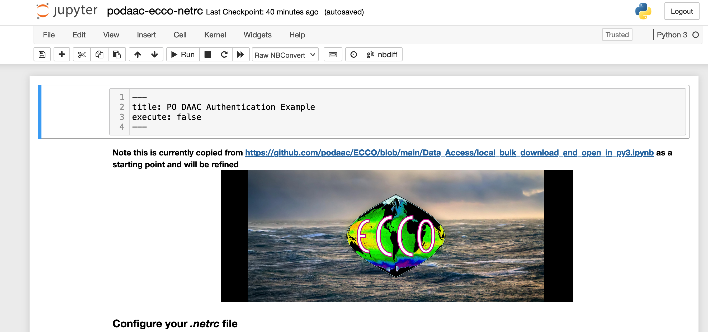
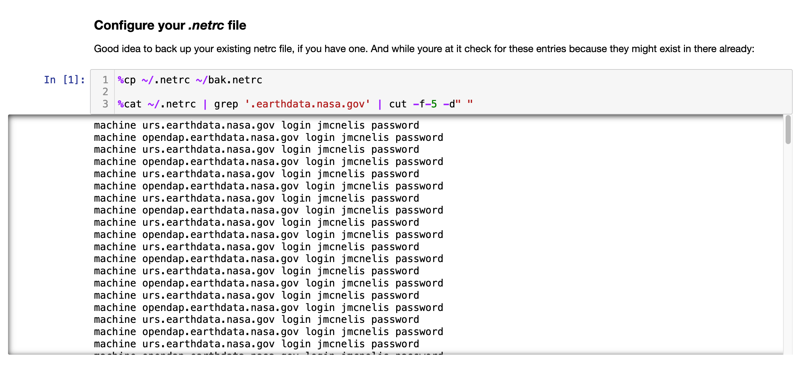
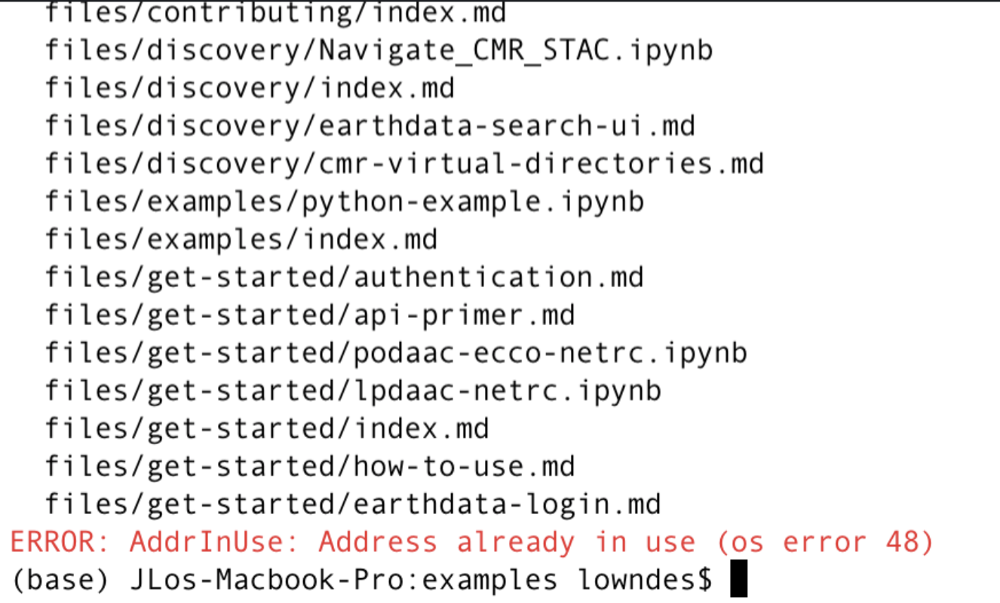

## Workflow for contributing to our Cookbook

Your Quarto workflow can be from the Command Line (bash), Python, or R. Its book chapters can be many file types, including `.md` , `.ipynb`, `.Rmd`, and `.qmd`. In all cases narrative and prose can be written in markdown, and chapters without code to execute can be written in `.md`. This workflow can streamline collaboration for scientific & technical writing across programming languages. 

:::{.callout-note}
In progress!  
:::


## GitHub Workflow

First let's talk about the GitHub part of the workflow. 

We will work in branches so as to not overwrite each other's work, and let GitHub do what it does best.

The `main` branch will be the current approved version of the book. The main branch is what displays at <https://nasa-openscapes.github.io/earthdata-cloud-cookbook>. 

A nice clean workflow with branches is to consider them temporary. You pull the most recent from `main`, you create a branch locally, you make your edits, you commit regularly, then you push back to github.com, create a pull request for it to be merged into `main`, and once approved, you delete the branch on github.com and also locally. That's the workflow we'll walk through here. A great resource on GitHub setup and collaboration is [Happy Git with R](https://happygitwithr.com/) (R-focused but fantastic philosophy and bash commands for setup, workflows, and collaboration).

The following assumes you're all [setup](/contributing/setup) from the previous chapter. 

### Branch setup 

First off, check what branch you're on. If you need to switch branches, use `git checkout`

```{.bash}
git branch          # returns all local branches
git checkout main   # switch branch to main
```

If you are already on the `main` branch, Git will tell you. 

If you have any residual branches from before, start off by deleting them (assuming they were temporary and have been merged into github.com — good to check first!)

```{.bash}
git branch -d branch-hame
```

Next, create a new branch, then switch to that branch to work in. `git checkout -b branch-name` is a one-step approach for `git branch branch-name` `git checkout branch-name` (read [more](https://git-scm.com/book/en/v2/Git-Branching-Basic-Branching-and-Merging)). 

```{.bash}
git checkout -b branch-name  # create and switch to new branch
```

Time for your Quarto workflow -- see below. After you've made some edits, you'll commit your changes. 

### Commit changes

You'll commit your work regularly as you go, writing commit messages: 

```{.bash}
git add --all 
git commit -m "my commit message here" 
```

### Push changes

When you're ready to push changes you've made in your branch, you'll first need to connect it to github.com by pushing it "upstream" to the "origin repository" (`-u` below is short for `--set-upstream`):

```{.bash}
git push -u origin branch-name  ## connect your branch to github.com and push
```

### Pull Request

Now it's on github.com, in a separate branch from main. You can go to <https://github.com/nasa-openscapes/earthdata-cloud-cookbook> and do a pull request, and tag someone to review (depending on what you've done and what we've talked about).

TODO: Let's discuss this:

-   When the pull request is merged, delete the branch on github.com

-   Then also delete the branch locally:

```{.bash}
git checkout main # switch to the main branch
git branch -d branch-hame
```

## Quarto Workflow

OK now we are setup and ready to work! The thing to do first is to "serve" (build) the book to make sure everything's working. (It's called "serve" because it's really a website that looks like a book).

The overall workflow will be to serve the book at the beginning, make edits and render your `.Rmd`/`.qmd` pages to view your edits as you go (`.md` are automatic). Make commits regularly, and then when you're ready to publish, you render the book with an additional command before pushing to github.com. Learn more about rendering here: <https://quarto.org/docs/computations/running-code.html#rendering>. From J.J. at RStudio:

> For `.Rmd` and `.qmd` files you need to render them (`.md` updates show on save because there is no render step). The reason Quarto doesn't render `.Rmd` and `.qmd` on save is that render could (potentially) be very long running and that cost shouldn't be imposed on you whenever you save.
> Here we are talking about the age old debate of whether computational markdown should be rendered on save when running a development server. Quarto currently doesn't do this to give the user a choice between an expensive render and a cheap save. See: <https://quarto.org/docs/websites/website-basics.html#workflow>.

### Quarto serve

#### Command line

To serve the book, run the following from the command line: 

```{.bash}
quarto serve
```

Paste the url/click from the console into your browser to see your updates.

Continue working, the `.md` files will refresh live! To refresh files with executable code, you'll need to render them individually. 

```{.bash}
quarto render my-document.ipynb      ## render a notebook
quarto render my-work.qmd            ## render a Quarto file
quarto render my-contribution.Rmd    ## render a RMarkdown file
```

To render and the whole book before publishing:

```{.bash}
quarto render
```

#### R

To the serve the book from R:

```{.r}
quarto::quarto_serve()
```

Continue working, the `.md` files will refresh live! To refresh files with executable code, type:

```{.r}
quarto::quarto_render("filename.ipynb")
```

To render and the whole book before publishing:

```{.r}
quarto::quarto_render()
```

## Updating the environment

As you work and add Python or R packages, you'll need to update the environment so that others can continue to collaborate with you too. 

### Command line

TODO!

### R

As we develop and add more package dependencies, re-run `renv::snapshot()` to update the environment. 
TODO make sure nothing to add about requirements.txt vs environment.yml

```{.r}
renv::snapshot()
```


## If you're testing code

The workflow there would be that a user decides that they will be the only one who runs the notebook. Adding `execute: false` basically means that Quarto never runs the code, but the user of course still can interactively in Jupyter.

## Quarto structure

The structure of the book is written in `_quarto.yml.` More description on this upcoming.

TODO: to add a chapter or shuffle things around...

## Conventions
*TODO: update this header with a better name*

### Executing notebooks

By adding YAML as a raw text cell at the top of an `.ipynb` file, you can control whether it is executed or not. 




This is likely the default way we want to go, to prevent things like this: 



Using `.qmd` there are also ways to control execution cell-by-cell via `# |` syntax within a code chunk; see <https://quarto.org/docs/computations/execution-options.html>


## Troubleshooting

### Error: AddrInUse

This error is because you had more than one instance of `quarto serve` going in your session. So close other command line instances that are running and try again. (If you use the R package and do `quarto_serve()` it will automatically make sure you only ever have 1 instance.)



